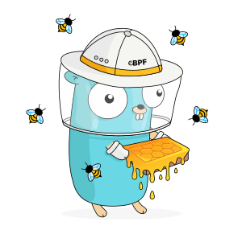

# ebpf学习笔记


## 仓库介绍

```
Something I hope you know before go into the coding~
First, please watch or star this repo, I'll be more happy if you follow me.
Bug report, questions and discussion are welcome, you can post an issue or pull a request.
```


## 目录


* [基础知识](docs/基础知识.md)
    * [clang与llvm](docs/基础知识/clang与llvm.md)
    * [BPF内核实现](docs/基础知识/BPF内核实现.md)
* [kubeArmor](docs/kubeArmor.md)
* [falco](docs/falco.md)
* [tracee](docs/tracee.md)
* [cilium](docs/cilium.md)
* [datadog](docs/datadog.md)
* [goebpf](docs/goebpf.md)
* [libbpf](docs/libbpf.md)
* [bcc](docs/bcc.md)
    * [argdist](docs/bcc/argdist.md)
    * [bashreadline](docs/bcc/bashreadline.md)
    * [bindsnoop](docs/bcc/bindsnoop.md)
    * [biolatency](docs/bcc/biolatency.md)
    * [biolatpcts](docs/bcc/biolatpcts.md)
    * [biosnoop](docs/bcc/biosnoop.md)
    * [biotop](docs/bcc/biotop.md)
    * [bitesize](docs/bcc/bitesize.md)
    * [bpflist](docs/bcc/bpflist.md)
    * [cachestat](docs/bcc/cachestat.md)
    * [cachetop](docs/bcc/cachetop.md)
    * [capable](docs/bcc/capable.md)
    * [cobjnew](docs/bcc/cobjnew.md)
    * [compactsnoop](docs/bcc/compactsnoop.md)
    * [cpudist](docs/bcc/cpudist.md)
    * [cpuunclaimed](docs/bcc/cpuunclaimed.md)
    * [dbslower](docs/bcc/dbslower.md)
    * [dbstat](docs/bcc/dbstat.md)
    * [dcsnoop](docs/bcc/dcsnoop.md)
    * [dcstat](docs/bcc/dcstat.md)
    * [deadlock](docs/bcc/deadlock.md)
    * [dirtop](docs/bcc/dirtop.md)
    * [drsnoop](docs/bcc/drsnoop.md)
    * [execsnoop](docs/bcc/execsnoop.md)
    * [exitsnoop](docs/bcc/exitsnoop.md)
    * [ext4dist](docs/bcc/ext4dist.md)
    * [ext4slower](docs/bcc/ext4slower.md)
    * [filelife](docs/bcc/filelife.md)
    * [fileslower](docs/bcc/fileslower.md)
    * [filetop](docs/bcc/filetop.md)
    * [funccount](docs/bcc/funccount.md)
    * [funcinterval](docs/bcc/funcinterval.md)
    * [funclatency](docs/bcc/funclatency.md)
    * [funcslower](docs/bcc/funcslower.md)
    * [gethostlatency](docs/bcc/gethostlatency.md)
    * [hardirqs](docs/bcc/hardirqs.md)
    * [javacalls](docs/bcc/javacalls.md)
    * [javaflow](docs/bcc/javaflow.md)
    * [javagc](docs/bcc/javagc.md)
    * [javaobjnew](docs/bcc/javaobjnew.md)
    * [javastat](docs/bcc/javastat.md)
    * [javathreads](docs/bcc/javathreads.md)
    * [killsnoop](docs/bcc/killsnoop.md)
    * [klockstat](docs/bcc/klockstat.md)
    * [llcstat](docs/bcc/llcstat.md)
    * [mdflush](docs/bcc/mdflush.md)
    * [memleak](docs/bcc/memleak.md)
    * [mountsnoop](docs/bcc/mountsnoop.md)
    * [mysqld_qslower](docs/bcc/mysqld_qslower.md)
    * [netqtop](docs/bcc/netqtop.md)
    * [nfsdist](docs/bcc/nfsdist.md)
    * [nfsslower](docs/bcc/nfsslower.md)
    * [nodegc](docs/bcc/nodegc.md)
    * [nodestat](docs/bcc/nodestat.md)
    * [offcputime](docs/bcc/offcputime.md)
    * [offwaketime](docs/bcc/offwaketime.md)
    * [oomkill](docs/bcc/oomkill.md)
    * [opensnoop](docs/bcc/opensnoop.md)
    * [perlcalls](docs/bcc/perlcalls.md)
    * [perlflow](docs/bcc/perlflow.md)
    * [perlstat](docs/bcc/perlstat.md)
    * [phpcalls](docs/bcc/phpcalls.md)
    * [phpflow](docs/bcc/phpflow.md)
    * [phpstat](docs/bcc/phpstat.md)
    * [pidpersec](docs/bcc/pidpersec.md)
    * [profile](docs/bcc/profile.md)
    * [pythoncalls](docs/bcc/pythoncalls.md)
    * [pythonflow](docs/bcc/pythonflow.md)
    * [pythongc](docs/bcc/pythongc.md)
    * [pythonstat](docs/bcc/pythonstat.md)
    * [readahead](docs/bcc/readahead.md)
    * [reset-trace](docs/bcc/reset-trace.md)
    * [rubycalls](docs/bcc/rubycalls.md)
    * [rubyflow](docs/bcc/rubyflow.md)
    * [rubygc](docs/bcc/rubygc.md)
    * [rubyobjnew](docs/bcc/rubyobjnew.md)
    * [rubystat](docs/bcc/rubystat.md)
    * [runqlat](docs/bcc/runqlat.md)
    * [runqlen](docs/bcc/runqlen.md)
    * [runqslower](docs/bcc/runqslower.md)
    * [shmsnoop](docs/bcc/shmsnoop.md)
    * [slabratetop](docs/bcc/slabratetop.md)
    * [sofdsnoop](docs/bcc/sofdsnoop.md)
    * [softirqs](docs/bcc/softirqs.md)
    * [solisten](docs/bcc/solisten.md)
    * [sslsniff](docs/bcc/sslsniff.md)
    * [stackcount](docs/bcc/stackcount.md)
    * [statsnoop](docs/bcc/statsnoop.md)
    * [swapin](docs/bcc/swapin.md)
    * [syncsnoop](docs/bcc/syncsnoop.md)
    * [syscount](docs/bcc/syscount.md)
    * [tclcalls](docs/bcc/tclcalls.md)
    * [tclflow](docs/bcc/tclflow.md)
    * [tclobjnew](docs/bcc/tclobjnew.md)
    * [tclstat](docs/bcc/tclstat.md)
    * [tcpaccept](docs/bcc/tcpaccept.md)
    * [tcpconnect](docs/bcc/tcpconnect.md)
    * [tcpconnlat](docs/bcc/tcpconnlat.md)
    * [tcpdrop](docs/bcc/tcpdrop.md)
    * [tcplife](docs/bcc/tcplife.md)
    * [tcpretrans](docs/bcc/tcpretrans.md)
    * [tcprtt](docs/bcc/tcprtt.md)
    * [tcpstates](docs/bcc/tcpstates.md)
    * [tcpsubnet](docs/bcc/tcpsubnet.md)
    * [tcpsynbl](docs/bcc/tcpsynbl.md)
    * [tcptop](docs/bcc/tcptop.md)
    * [tcptracer](docs/bcc/tcptracer.md)
    * [threadsnoop](docs/bcc/threadsnoop.md)
    * [tplist](docs/bcc/tplist.md)
    * [trace](docs/bcc/trace.md)
    * [ttysnoop](docs/bcc/ttysnoop.md)
    * [vfscount](docs/bcc/vfscount.md)
    * [vfsstat](docs/bcc/vfsstat.md)
    * [virtiostat](docs/bcc/virtiostat.md)
    * [wakeuptime](docs/bcc/wakeuptime.md)
    * [xfsdist](docs/bcc/xfsdist.md)
    * [xfsslower](docs/bcc/xfsslower.md)


## 相关站点

* <https://ebpf.io/>


## 参考

* <https://zhuanlan.zhihu.com/p/470680443>


---




---
