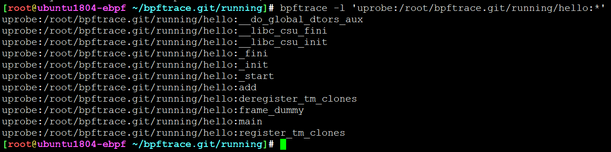

<!-- TOC -->

- [举栗子](#举栗子)
  - [profile](#profile)
  - [tracepoint](#tracepoint)
  - [uprobe](#uprobe)
  - [变量赋值](#变量赋值)
  - [中途退出](#中途退出)

<!-- /TOC -->

# 举栗子


```
bpftrace-e 'BEGIN { printf("hello world!\n"); }'
```

```
bpftrace -e 'kprobe:do_nanosleep {printf("sleep by %d\n", comm);}'
```

```
bpftrace -e 'tracepoint:syscalls:sys_enter_execve { printf("%s -> %s\n", comm, str(args->filename))}'
bpftrace -e 'tracepoint:syscalls:sys_enter_openat { printf("%s -> %s\n", comm, str(args->filename))}'

```

```
bpftrace -e 'tracepoint:syscalls:sys_enter_execve { printf("%s\n", comm); join(args->argv); }'
```

```
bpftrace -e 'tracepoint:syscalls:sys_enter_openat { printf("%s -> %s\n", comm, str(args->filename))}'
```


```
bpftrace -e 'tracepoint:raw_syscalls:sys_enter { @[comm] = count(); }'
```

```
bpftrace -e 'tracepoint:raw_syscalls:sys_enter { @[comm] = count(); }'
```

```
bpftrace -e 'tracepoint:raw_syscalls:sys_enter /pid==1871/  { printf("%s ",comm);@[pid, comm] = count(); }'
```

## profile


```
bpftrace -e 'profile:hz:49 /pid == 1871/ { @[ustack] = count(); }'
```


## tracepoint

```
bpftrace -e 'tracepoint:syscalls:sys_exit_read /args->ret/ { @[comm] = sum(args->ret); }'
```

```
bpftrace -e 'tracepoint:block:block_rq_issue {printf("%d %s %d\n", pid,comm,args->bytes);}'
```


```
bpftrace -e 'tracepoint:syscalls:sys_exit_read { @[comm] = hist(args->ret); }'
```

```
bpftrace -e 'software:major-faults:1 { @[comm] = count()}'
```


## uprobe

```
bpftrace-e 'uprobe:/home/qz/a.out:add { @a= arg0;}'
```

```
bpftrace -e 'uprobe:/root/bpftrace.git/running/hello:add { @a=arg0; printf("%d\n", @a)}'

bpftrace -e 'uprobe:/root/bpftrace.git/running/hello:add { @a=arg0; printf("%d\n", arg0)}'
```

```
bpftrace -l 'uprobe:/root/bpftrace.git/running/hello:*'
```




## software


## hardware


## funcinterval


## usdt


## 变量赋值

```
bpftrace -e 'uprobe:/root/bpftrace.git/running/hello:add { $x=42; printf("$x is %d\n", $x)}'
```

```
bpftrace -e 'uprobe:/root/bpftrace.git/running/hello:add { $x=42; printf("$x is %d   %llx %s\n", $x, $x, str($x)); exit()}'
```


## 中途退出

使用exit()可在bpf中途退出

```
bpftrace -e 'uprobe:/root/bpftrace.git/running/hello:add { $x=42; printf("$x is %d   %llx %s\n", $x, $x, str($x)); exit()}'
```


---
