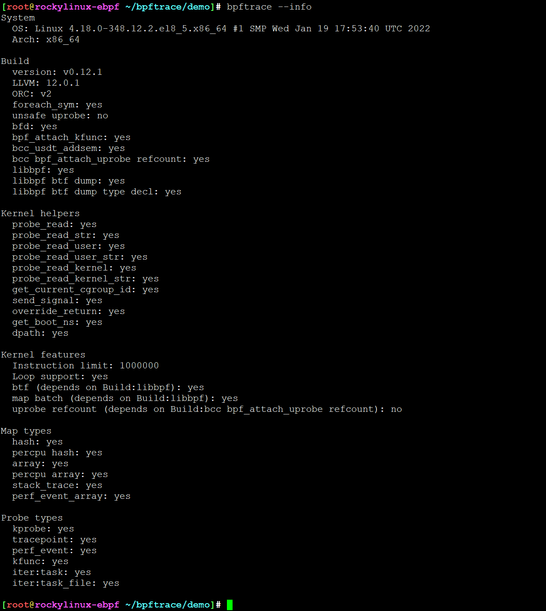

# 命令帮助

```
BPFTRACE(8)                                                                                                                       System Manager's Manual                                                                                                                      BPFTRACE(8)

NAME
       bpftrace - the eBPF tracing language & frontend

SYNOPSIS
       bpftrace [OPTIONS] FILE
       bpftrace [OPTIONS] -e 'program code'

DESCRIPTION
       bpftrace is a high-level tracing language for Linux enhanced Berkeley Packet Filter (eBPF) available in recent Linux kernels (4.x).

       bpftrace uses:

       ?   LLVM as a backend to compile scripts to BPF-bytecode

       ?   BCC for interacting with the Linux BPF system

       As well as the existing Linux tracing capabilities:

       ┌─────────┬─────────────┬──────────────┐
       │         │   kernel    │   userland   │
       ├─────────┼─────────────┼──────────────┤
       │ static  │ tracepoints │ USDT* probes │
       ├─────────┼─────────────┼──────────────┤
       │ dynamic │   kprobes   │   uprobes    │
       └─────────┴─────────────┴──────────────┘
       *USDT = user-level statically defined tracing

       The bpftrace language is inspired by awk and C, and predecessor tracers such as DTrace and SystemTap.

       See EXAMPLES and ONELINERS if you are impatient.
       See PROBE TYPES and BUILTINS (variables/functions) for the bpftrace language elements.

OPTIONS
       -B MODE
              The buffering mode to be used for output ('full', 'none').

       -c CMD Helper to run CMD. Equivalent to manually running CMD and then giving passing the PID to -p. This is useful to ensure you've traced at least the duration CMD's execution.

       -d     Debug info dry run.

       -dd    Verbose Debug info dry run.

       -e 'PROGRAM'
              Execute PROGRAM.

       -f FORMAT
              The format to be used for output ('text'. 'json'). 默认是text

       -h | --help
              Show help message.

       -I DIR Add the directory to the INCLUDE search path.

       --include FILE
              Add a #include file before preprocessing.

       --info Print information about kernel BPF support.

       -k     Emit a warning when a bpf helper returns an error (except read functions).

       -kk    Check all bpf helper functions.

       -l [searchterm]
              List probes.

       -o FILE
              Redirect bpftrace output to file.

       -p PID Enable USDT probes on PID. Will terminate bpftrace on PID termination. Note this is not a global PID filter on probes.

       --unsafe
              Enable unsafe builtin functions. By default, bpftrace runs in safe mode. Safe mode ensure programs cannot modify system state.  Unsafe builtin functions are marked as such in BUILTINS (functions).

       --usdt-file-activation
              Activate usdt semaphores based on file path..

       -v     Verbose messages.

       -V | --version
              Print version of bpftrace.

EXAMPLES
       bpftrace -l '*sleep*'
              List probes containing "sleep".

       bpftrace -e 'kprobe:do_nanosleep { printf("PID %d sleeping\n", pid); }'
              Trace processes calling sleep.

       bpftrace -c 'sleep 5' -e 'kprobe:do_nanosleep { printf("PID %d sleeping\n", pid); }'
              run "sleep 5" in a new process and then trace processes calling sleep.

       bpftrace -e 'tracepoint:raw_syscalls:sys_enter { @[comm]=count(); }'
              Count syscalls by process name.

ONELINERS
       For brevity, just the the actual BPF code is shown below.
       Usage: bpftrace -e 'bpf-code'

       New processes with arguments:
              bpftrace -e 'tracepoint:syscalls:sys_enter_execve { join(args->argv); }'

       Files opened by process:
              bpftrace -e 'tracepoint:syscalls:sys_enter_open { printf("%s %s\n", comm, str(args->filename)); }'

       Syscall count by program:
              bpftrace -e 'tracepoint:raw_syscalls:sys_enter { @[comm] = count(); }'

       Syscall count by syscall:
              bpftrace -e 'tracepoint:syscalls:sys_enter_* { @[probe] = count(); }

       Syscall count by process:
              bpftrace -e 'tracepoint:raw_syscalls:sys_enter { @[pid, comm, uid, tid] = count(); }'

       Read bytes by process:
              bpftrace -e 'tracepoint:syscalls:sys_exit_read /args->ret/ { @[comm] = sum(args->ret); }'

       Read size distribution by process:
              bpftrace -e 'tracepoint:syscalls:sys_exit_read { @[comm] = hist(args->ret); }'

       Disk size by process:
              bpftrace -e 'tracepoint:block:block_rq_issue { printf("%d %s %d\n", pid, comm, args->bytes); }'

       Pages paged in by process:
              bpftrace -e 'software:major-faults:1 { @[comm] = count(); }'

       Page faults by process:
              bpftrace -e 'software:faults:1 { @[comm] = count(); }'

       Profile user-level stacks at 99 Hertz, for PID 189:
              bpftrace -e 'profile:hz:99 /pid == 189/ { @[ustack] = count(); }'

PROBE TYPES
   KPROBES
       Attach a bpftrace script to a kernel function, to be executed when that function is called:

       kprobe:vfs_read { ... }

   UPROBES
       Attach script to a userland function:

       uprobe:/bin/bash:readline { ... }

   TRACEPOINTS
       Attach script to a statically defined tracepoint in the kernel:

       tracepoint:sched:sched_switch { ... }

       Tracepoints are guaranteed to be stable between kernel versions, unlike kprobes.

   SOFTWARE
       Attach script to kernel software events, executing once every provided count or use a default:

       software:faults:100 software:faults:

   HARDWARE
       Attach script to hardware events (PMCs), executing once every provided count or use a default:

       hardware:cache-references:1000000 hardware:cache-references:

   PROFILE
       Run the script on all CPUs at specified time intervals:

       profile:hz:99 { ... }

       profile:s:1 { ... }

       profile:ms:20 { ... }

       profile:us:1500 { ... }

   INTERVAL
       Run the script once per interval, for printing interval output:

       interval:s:1 { ... }

       interval:ms:20 { ... }

   MULTIPLE ATTACHMENT POINTS
       A single probe can be attached to multiple events:

       kprobe:vfs_read,kprobe:vfs_write { ... }

   WILDCARDS
       Some probe types allow wildcards to be used when attaching a probe:

       kprobe:vfs_* { ... }

   PREDICATES
       Define conditions for which a probe should be executed:

       kprobe:sys_open / uid == 0 / { ... }

BUILTINS
       The following variables and functions are available for use in bpftrace scripts:

   VARIABLES
       pid    Process ID (kernel tgid) %d

       tid    Thread ID (kernel pid) %d

       cgroup Cgroup ID of the current process %d

       uid    User ID %d

       gid    Group ID %d

       nsecs  Nanosecond timestamp %d

       elapsed %d
              Nanoseconds since bpftrace initialization

       cpu    Processor ID %d

       comm   Process name %s

       kstack Kernel stack trace

       ustack User stack trace

       arg0, arg1, ... etc.
              Arguments to the function being traced

       retval Return value from function being traced

       func   Name of the function currently being traced %s

       probe  Full name of the probe

       curtask
              Current task_struct as a u64.

       rand   Random number of type u32.

   FUNCTIONS
       hist(int n)
              Produce a log2 histogram of values of n

       lhist(int n, int min, int max, int step)
              Produce a linear histogram of values of n

       count()
              Count the number of times this function is called

       sum(int n)
              Sum this value

       min(int n)
              Record the minimum value seen

       max(int n)
              Record the maximum value seen

       avg(int n)
              Average this value

       stats(int n)
              Return the count, average, and total for this value

       delete(@x)
              Delete the map element passed in as an argument

       str(char *s)
              Returns the string pointed to by s

       printf(char *fmt, ...)
              Print formatted to stdout

       print(@x[, int top [, int div]])
              Print a map, with optional top entry count and divisor

       clear(@x)
              Delete all key/values from a map

       ksym(void *p)
              Resolve kernel address

       usym(void *p)
              Resolve user space address

       kaddr(char *name)
              Resolve kernel symbol name

       uaddr(char *name)
              Resolve user space symbol name

       reg(char *name)
              Returns the value stored in the named register

       join(char *arr[])
              Prints the string array

       time(char *fmt)
              Print the current time

       cat(char *filename)
              Print file content

       ntop([int af, ]int|char[4|16] addr)
              Convert IP address data to text

       system(char *fmt) (unsafe)
              Execute shell command

       exit() Quit bpftrace

       kstack([StackMode mode, ][int level])
              Kernel stack trace

       ustack([StackMode mode, ][int level])
              User stack trace

FURTHER READING
       The official documentation can be found here:
       https://github.com/iovisor/bpftrace/blob/master/docs

HISTORY
       The first official talk by Alastair on bpftrace happened at the Tracing Summit in Edinburgh, Oct 25th 2018.

AUTHOR
       Created by Alastair Robertson.
       Manpage by Stephan Schuberth.

SEE ALSO
       man -k bcc, after having installed the bpfcc-tools package under Ubuntu.

CONTRIBUTING
       Prior to contributing new tools, read the official checklist at:
       https://github.com/iovisor/bpftrace/blob/master/CONTRIBUTING-TOOLS.md
```



