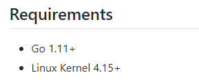
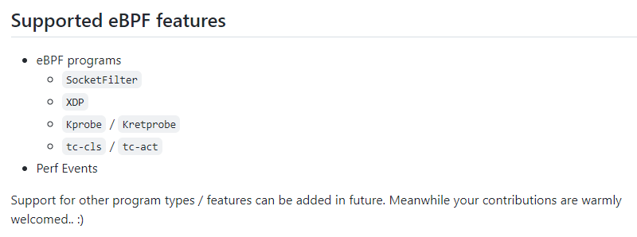

# goebpf

* 仓库地址 : <https://github.com/dropbox/goebpf>
* go仓库地址: <https://pkg.go.dev/github.com/dropbox/goebpf>





* 支持的内容并不是很多，看来还有很多搞头


几个go语言实现的bpf工具

* <https://github.com/iovisor/gobpf>
* <https://github.com/dropbox/goebpf>
* <https://github.com/cilium/ebpf>
* <https://github.com/andrewkroh/go-ebpf>


```
除了iovisor/gobpf之外，我还发现了另外三个最新的项目，可以让你在Go中写出用户层(userland)部分。

https://github.com/dropbox/goebpf

https://github.com/cilium/ebpf

https://github.com/andrewkroh/go-ebpf

Dropbox的版本不需要任何C库，但你需要自己用Clang构建BPF的内核部分，然后用Go程序将其加载到内核中。

Cilium的版本和Dropbox的版本有相同的具体内容。但值得一提的是，最主要的原因是它是由Cilium项目的人做的，这意味着它成功性更大。

第三个项目我出于完整性的考虑而列出了。和前面两个项目一样，它没有外部的C语言依赖，需要用C语言手动构建BPF程序，但看起来，未来的前景不是特别乐观。
```


---
