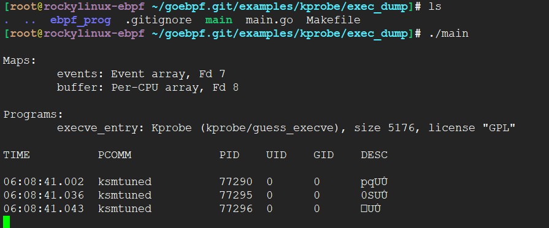

<!-- MDTOC maxdepth:6 firsth1:1 numbering:0 flatten:0 bullets:1 updateOnSave:1 -->

- [快速开始](#快速开始)   
   - [前提条件](#前提条件)   
   - [环境](#环境)   
   - [获取仓库源码](#获取仓库源码)   

<!-- /MDTOC -->
# 快速开始

## 前提条件

```
Go 1.11+
Linux Kernel 4.15+
```

## 环境

```
NAME="Rocky Linux"
VERSION="8.5 (Green Obsidian)"
ID="rocky"
ID_LIKE="rhel centos fedora"
VERSION_ID="8.5"
PLATFORM_ID="platform:el8"
PRETTY_NAME="Rocky Linux 8.5 (Green Obsidian)"
ANSI_COLOR="0;32"
CPE_NAME="cpe:/o:rocky:rocky:8:GA"
HOME_URL="https://rockylinux.org/"
BUG_REPORT_URL="https://bugs.rockylinux.org/"
ROCKY_SUPPORT_PRODUCT="Rocky Linux"
ROCKY_SUPPORT_PRODUCT_VERSION="8"
```


```
Linux rockylinux-ebpf 4.18.0-348.12.2.el8_5.x86_64 #1 SMP Wed Jan 19 17:53:40 UTC 2022 x86_64 x86_64 x86_64 GNU/Linux
```


```
go version go1.17.3 linux/amd64
```


## 获取仓库源码

* <https://github.com/dropbox/goebpf>

```
git clone https://github.com/dropbox/goebpf goebpf.git
```

安装go依赖包/库

```
go mod tidy
```


```
cd goebpf.git/examples/kprobe/exec_dump
make
./main
```



* DESC为何乱码？


PLUS: 总感觉少了点什么


---
