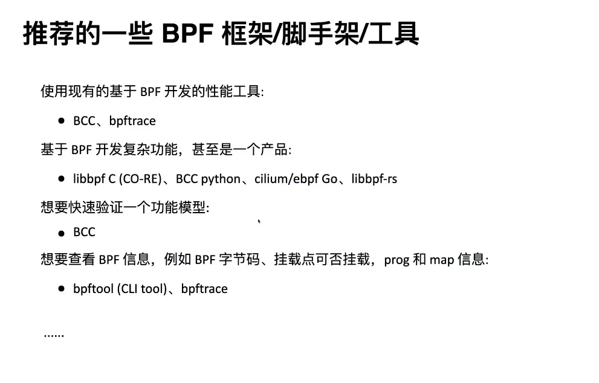
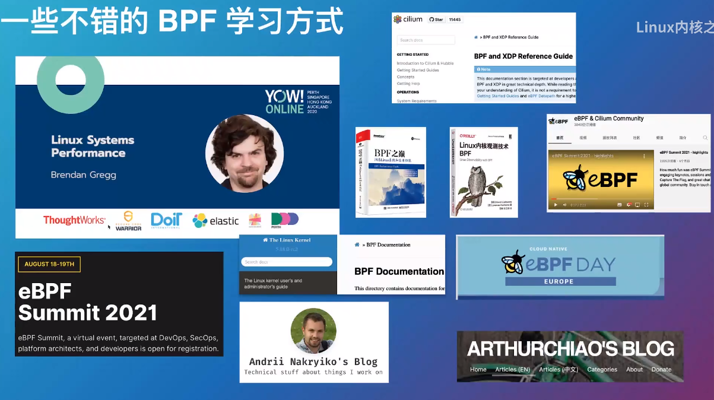

# eBPF学习路线分享与LMP项目介绍

* <https://www.bilibili.com/video/BV1su411y71x?spm_id_from=333.999.0.0>


新类型软件


类比js蛮形象


查看当前系统当前已经存在的ebpf程序


如何光速跑起一个bpf程序


```
[root@rockylinux-ebpf ~/bpftrace/demo]# ./syscall.sh
Attaching 1 probe...
^C

@[syscall.sh]: 2
@[rsyslogd]: 9
@[smartd]: 19
@[hostname]: 30
@[tty]: 30
@[rs:main Q:Reg]: 33
@[dircolors]: 40
@[date]: 42
@[polkitd]: 43
@[rpcbind]: 56
@[sssd]: 57
@[tput]: 60
@[basename]: 70
@[cat]: 86
@[gdbus]: 131
@[NetworkManager]: 148
@[systemd-udevd]: 182
@[(tmpfiles)]: 193
@[anacron]: 210
@[lsmd]: 224
@[auditd]: 229
@[sed]: 242
@[grep]: 248
@[id]: 259
@[0anacron]: 271
@[systemd-machine]: 276
@[dbus-daemon]: 303
@[systemd-logind]: 416
@[run-parts]: 456
@[grepconf.sh]: 459
@[systemd-cgroups]: 478
@[logger]: 488
@[systemd-journal]: 795
@[sssd_be]: 838
@[gmain]: 844
@[sleep]: 952
@[crond]: 1387
@[pidof]: 1631
@[systemd]: 1839
@[bash]: 1923
@[irqbalance]: 2184
@[sssd_nss]: 2579
@[sshd]: 3130
@[systemd-tmpfile]: 3220
@[in:imjournal]: 3816
@[bpftool]: 6493
@[tuned]: 6838
@[awk]: 8540
@[ksmtuned]: 10696
@[bpftrace]: 16848
@[pgrep]: 44534
```

绝对不仅仅是工具


bpf内部原理不容错过


jit将字节码转为本机硬编码，高效率执行


BPF架手架



* <https://github.com/libbpf/libbpf-bootstrap>
* <https://gh.fakev.cn/libbpf/libbpf-bootstrap>


clang支持btf字段偏移重定位


解决可移植性问题


只允许使用辅助函数

LMP




 

---
