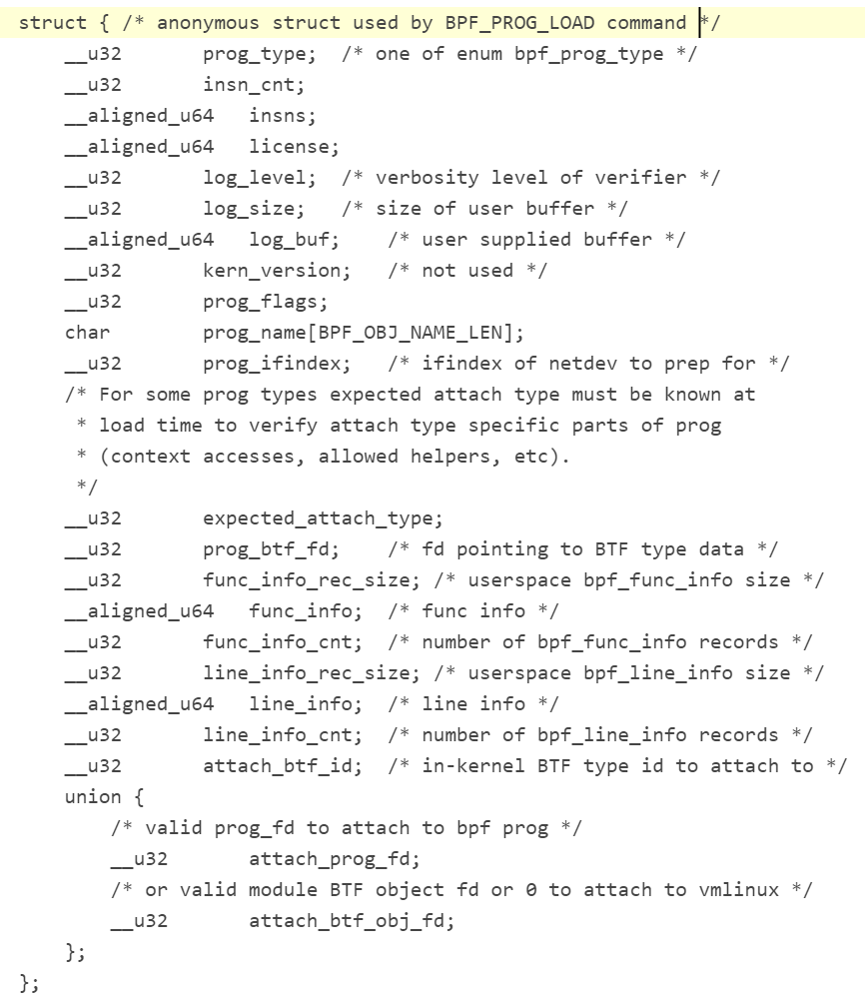

# BPF内核实现


## 系统调用入口

* 系统调用入口是切入点，一个系统调用复用多个功能，状态机

```
SYSCALL_DEFINE3(bpf, int, cmd, union bpf_attr __user *, uattr, unsigned int, size)
{
	union bpf_attr attr;
	int err;

	if (sysctl_unprivileged_bpf_disabled && !bpf_capable())
		return -EPERM;

	err = bpf_check_uarg_tail_zero(uattr, sizeof(attr), size);
	if (err)
		return err;
	size = min_t(u32, size, sizeof(attr));

	/* copy attributes from user space, may be less than sizeof(bpf_attr) */
	memset(&attr, 0, sizeof(attr));
	if (copy_from_user(&attr, uattr, size) != 0)
		return -EFAULT;

	err = security_bpf(cmd, &attr, size);
	if (err < 0)
		return err;

	switch (cmd) {
	case BPF_MAP_CREATE:
		err = map_create(&attr);
		break;
	case BPF_MAP_LOOKUP_ELEM:
		err = map_lookup_elem(&attr);
		break;
	case BPF_MAP_UPDATE_ELEM:
		err = map_update_elem(&attr);
		break;
	case BPF_MAP_DELETE_ELEM:
		err = map_delete_elem(&attr);
		break;
	case BPF_MAP_GET_NEXT_KEY:
		err = map_get_next_key(&attr);
		break;
	case BPF_MAP_FREEZE:
		err = map_freeze(&attr);
		break;
	case BPF_PROG_LOAD:
		err = bpf_prog_load(&attr, uattr);
		break;
	case BPF_OBJ_PIN:
		err = bpf_obj_pin(&attr);
		break;
	case BPF_OBJ_GET:
		err = bpf_obj_get(&attr);
		break;
	case BPF_PROG_ATTACH:
		err = bpf_prog_attach(&attr);
		break;
	case BPF_PROG_DETACH:
		err = bpf_prog_detach(&attr);
		break;
	case BPF_PROG_QUERY:
		err = bpf_prog_query(&attr, uattr);
		break;
	case BPF_PROG_TEST_RUN:
		err = bpf_prog_test_run(&attr, uattr);
		break;
	case BPF_PROG_GET_NEXT_ID:
		err = bpf_obj_get_next_id(&attr, uattr,
					  &prog_idr, &prog_idr_lock);
		break;
	case BPF_MAP_GET_NEXT_ID:
		err = bpf_obj_get_next_id(&attr, uattr,
					  &map_idr, &map_idr_lock);
		break;
	case BPF_BTF_GET_NEXT_ID:
		err = bpf_obj_get_next_id(&attr, uattr,
					  &btf_idr, &btf_idr_lock);
		break;
	case BPF_PROG_GET_FD_BY_ID:
		err = bpf_prog_get_fd_by_id(&attr);
		break;
	case BPF_MAP_GET_FD_BY_ID:
		err = bpf_map_get_fd_by_id(&attr);
		break;
	case BPF_OBJ_GET_INFO_BY_FD:
		err = bpf_obj_get_info_by_fd(&attr, uattr);
		break;
	case BPF_RAW_TRACEPOINT_OPEN:
		err = bpf_raw_tracepoint_open(&attr);
		break;
	case BPF_BTF_LOAD:
		err = bpf_btf_load(&attr);
		break;
	case BPF_BTF_GET_FD_BY_ID:
		err = bpf_btf_get_fd_by_id(&attr);
		break;
	case BPF_TASK_FD_QUERY:
		err = bpf_task_fd_query(&attr, uattr);
		break;
	case BPF_MAP_LOOKUP_AND_DELETE_ELEM:
		err = map_lookup_and_delete_elem(&attr);
		break;
	case BPF_MAP_LOOKUP_BATCH:
		err = bpf_map_do_batch(&attr, uattr, BPF_MAP_LOOKUP_BATCH);
		break;
	case BPF_MAP_LOOKUP_AND_DELETE_BATCH:
		err = bpf_map_do_batch(&attr, uattr,
				       BPF_MAP_LOOKUP_AND_DELETE_BATCH);
		break;
	case BPF_MAP_UPDATE_BATCH:
		err = bpf_map_do_batch(&attr, uattr, BPF_MAP_UPDATE_BATCH);
		break;
	case BPF_MAP_DELETE_BATCH:
		err = bpf_map_do_batch(&attr, uattr, BPF_MAP_DELETE_BATCH);
		break;
	case BPF_LINK_CREATE:
		err = link_create(&attr);
		break;
	case BPF_LINK_UPDATE:
		err = link_update(&attr);
		break;
	case BPF_LINK_GET_FD_BY_ID:
		err = bpf_link_get_fd_by_id(&attr);
		break;
	case BPF_LINK_GET_NEXT_ID:
		err = bpf_obj_get_next_id(&attr, uattr,
					  &link_idr, &link_idr_lock);
		break;
	case BPF_ENABLE_STATS:
		err = bpf_enable_stats(&attr);
		break;
	case BPF_ITER_CREATE:
		err = bpf_iter_create(&attr);
		break;
	case BPF_LINK_DETACH:
		err = link_detach(&attr);
		break;
	case BPF_PROG_BIND_MAP:
		err = bpf_prog_bind_map(&attr);
		break;
	default:
		err = -EINVAL;
		break;
	}

	return err;
}
```


## BPF_BTF_LOAD加载BPF程序


BPF_PROG_LOAD命令负责加载一段BPF程序到内核当中：

* 拷贝程序到内核；
* 校验它的安全性；
* 如果可能对它进行JIT编译；
* 然后分配一个文件句柄fd给它。


```
static int bpf_prog_load(union bpf_attr *attr, union bpf_attr __user *uattr)
{       
    enum bpf_prog_type type = attr->prog_type;
    struct bpf_prog *prog, *dst_prog = NULL;
    struct btf *attach_btf = NULL;
    int err;
    char license[128];
    bool is_gpl;

    if (CHECK_ATTR(BPF_PROG_LOAD))
        return -EINVAL;

    if (attr->prog_flags & ~(BPF_F_STRICT_ALIGNMENT |
                 BPF_F_ANY_ALIGNMENT |
                 BPF_F_TEST_STATE_FREQ |
                 BPF_F_SLEEPABLE |
                 BPF_F_TEST_RND_HI32))
        return -EINVAL;

    if (!IS_ENABLED(CONFIG_HAVE_EFFICIENT_UNALIGNED_ACCESS) &&
        (attr->prog_flags & BPF_F_ANY_ALIGNMENT) &&
        !bpf_capable())
        return -EPERM;

    /* copy eBPF program license from user space */
    if (strncpy_from_user(license, u64_to_user_ptr(attr->license),
                  sizeof(license) - 1) < 0)
        return -EFAULT;
    license[sizeof(license) - 1] = 0;

    /* eBPF programs must be GPL compatible to use GPL-ed functions */
    is_gpl = license_is_gpl_compatible(license);

    if (attr->insn_cnt == 0 ||
        attr->insn_cnt > (bpf_capable() ? BPF_COMPLEXITY_LIMIT_INSNS : BPF_MAXINSNS))
        return -E2BIG;
    if (type != BPF_PROG_TYPE_SOCKET_FILTER &&
        type != BPF_PROG_TYPE_CGROUP_SKB &&
        !bpf_capable())
        return -EPERM;

    if (is_net_admin_prog_type(type) && !capable(CAP_NET_ADMIN) && !capable(CAP_SYS_ADMIN))
        return -EPERM;
    if (is_perfmon_prog_type(type) && !perfmon_capable())
        return -EPERM;

    /* attach_prog_fd/attach_btf_obj_fd can specify fd of either bpf_prog
     * or btf, we need to check which one it is
     */
    if (attr->attach_prog_fd) {
        dst_prog = bpf_prog_get(attr->attach_prog_fd);
        if (IS_ERR(dst_prog)) {
            dst_prog = NULL;
            attach_btf = btf_get_by_fd(attr->attach_btf_obj_fd);
            if (IS_ERR(attach_btf))
                return -EINVAL;
            if (!btf_is_kernel(attach_btf)) {
                /* attaching through specifying bpf_prog's BTF
                 * objects directly might be supported eventually
                 */
                btf_put(attach_btf);
                return -ENOTSUPP;
            }
        }
    } else if (attr->attach_btf_id) {
        /* fall back to vmlinux BTF, if BTF type ID is specified */
        attach_btf = bpf_get_btf_vmlinux();
        if (IS_ERR(attach_btf))
            return PTR_ERR(attach_btf);
        if (!attach_btf)
            return -EINVAL;
        btf_get(attach_btf);
    }

    bpf_prog_load_fixup_attach_type(attr);
    if (bpf_prog_load_check_attach(type, attr->expected_attach_type,
                       attach_btf, attr->attach_btf_id,
                       dst_prog)) {
        if (dst_prog)
            bpf_prog_put(dst_prog);
        if (attach_btf)
            btf_put(attach_btf);
        return -EINVAL;
    }

    /* plain bpf_prog allocation */
    prog = bpf_prog_alloc(bpf_prog_size(attr->insn_cnt), GFP_USER);
    if (!prog) {
        if (dst_prog)
            bpf_prog_put(dst_prog);
        if (attach_btf)
            btf_put(attach_btf);
        return -ENOMEM;
    }

    prog->expected_attach_type = attr->expected_attach_type;
    prog->aux->attach_btf = attach_btf;
    prog->aux->attach_btf_id = attr->attach_btf_id;
    prog->aux->dst_prog = dst_prog;
    prog->aux->offload_requested = !!attr->prog_ifindex;
    prog->aux->sleepable = attr->prog_flags & BPF_F_SLEEPABLE;

    err = security_bpf_prog_alloc(prog->aux);
    if (err)
        goto free_prog;

    prog->aux->user = get_current_user();
    prog->len = attr->insn_cnt;

    err = -EFAULT;
    if (copy_from_user(prog->insns, u64_to_user_ptr(attr->insns),
               bpf_prog_insn_size(prog)) != 0)
        goto free_prog_sec;

    prog->orig_prog = NULL;
    prog->jited = 0;

    atomic64_set(&prog->aux->refcnt, 1);
    prog->gpl_compatible = is_gpl ? 1 : 0;

    if (bpf_prog_is_dev_bound(prog->aux)) {
        err = bpf_prog_offload_init(prog, attr);
        if (err)
            goto free_prog_sec;
    }

    /* find program type: socket_filter vs tracing_filter */
    err = find_prog_type(type, prog);
    if (err < 0)
        goto free_prog_sec;

    prog->aux->load_time = ktime_get_boot_ns();
    err = bpf_obj_name_cpy(prog->aux->name, attr->prog_name,
                   sizeof(attr->prog_name));
    if (err < 0)
        goto free_prog_sec;

    /* run eBPF verifier */  // 关键点，校验bpf程序
    err = bpf_check(&prog, attr, uattr);
    if (err < 0)
        goto free_used_maps;

    prog = bpf_prog_select_runtime(prog, &err);
    if (err < 0)
        goto free_used_maps;

    err = bpf_prog_alloc_id(prog);
    if (err)
        goto free_used_maps;

    /* Upon success of bpf_prog_alloc_id(), the BPF prog is
     * effectively publicly exposed. However, retrieving via
     * bpf_prog_get_fd_by_id() will take another reference,
     * therefore it cannot be gone underneath us.
     *
     * Only for the time /after/ successful bpf_prog_new_fd()
     * and before returning to userspace, we might just hold
     * one reference and any parallel close on that fd could
     * rip everything out. Hence, below notifications must
     * happen before bpf_prog_new_fd().
     *
     * Also, any failure handling from this point onwards must
     * be using bpf_prog_put() given the program is exposed.
     */
    bpf_prog_kallsyms_add(prog);
    perf_event_bpf_event(prog, PERF_BPF_EVENT_PROG_LOAD, 0);
    bpf_audit_prog(prog, BPF_AUDIT_LOAD);

    err = bpf_prog_new_fd(prog);
    if (err < 0)
        bpf_prog_put(prog);
    // 成功从用户态拷贝到内核态，并且返回了一个bpf文件描述符
    return err;

free_used_maps:
    /* In case we have subprogs, we need to wait for a grace
     * period before we can tear down JIT memory since symbols
     * are already exposed under kallsyms.
     */
    __bpf_prog_put_noref(prog, prog->aux->func_cnt);
    return err;
free_prog_sec:
    free_uid(prog->aux->user);
    security_bpf_prog_free(prog->aux);
free_prog:
    if (prog->aux->attach_btf)
        btf_put(prog->aux->attach_btf);
    bpf_prog_free(prog);
    return err;
}

```


### bpf_prog

```
struct bpf_prog {
    u16         pages;      /* Number of allocated pages */
    u16         jited:1,    /* Is our filter JIT'ed? */
                jit_requested:1,/* archs need to JIT the prog */
#ifdef __GENKSYMS__
                undo_set_mem:1, /* Passed set_memory_ro() checkpoint */
#endif
                gpl_compatible:1, /* Is filter GPL compatible? */
                cb_access:1,    /* Is control block accessed? */
                dst_needed:1,   /* Do we need dst entry? */
                blinded:1,  /* Was blinded */
                is_func:1,  /* program is a bpf function */
                kprobe_override:1, /* Do we override a kprobe? */
#ifdef __GENKSYMS__
                has_callchain_buf:1; /* callchain buffer allocated? */
#else
                has_callchain_buf:1, /* callchain buffer allocated? */
                enforce_expected_attach_type:1, /* Enforce expected_attach_type checking at attach time */
                call_get_stack:1; /* Do we call bpf_get_stack() or bpf_get_stackid() */
#endif
    enum bpf_prog_type  type;       /* Type of BPF program */
    enum bpf_attach_type    expected_attach_type; /* For some prog types */
    u32         len;        /* Number of filter blocks */
    u32         jited_len;  /* Size of jited insns in bytes */
    u8          tag[BPF_TAG_SIZE];
    struct bpf_prog_aux *aux;       /* Auxiliary fields */
    struct sock_fprog_kern  *orig_prog; /* Original BPF program */
    unsigned int        (*bpf_func)(const void *ctx,
                        const struct bpf_insn *insn);
    /* Instructions for interpreter */
    union {
        struct sock_filter  insns[0];
        struct bpf_insn     insnsi[0]; // 零长度数组
    };
};

```

其中重要的成员如下：

* jit：如果有jit硬件辅助设备，则会用到这个字段，按位使用
* len：程序包含bpf指令的数量
* type：当前bpf程序的类型(kprobe/tracepoint/perf_event/sk_filter/sched_cls/sched_act/xdp/cg_skb)；
* aux：主要用来辅助verifier校验和转换的数据；
* orig_prog：原始的未转换的bpf程序
* bpf_func：运行时BPF程序的入口。如果JIT转换成功，这里指向的就是BPF程序JIT转换后的映像；否则这里指向内核解析器(interpreter)的通用入口__bpf_prog_run()；
* insnsi[]：从用户态拷贝过来的，BPF程序原始指令的存放空间；





### bpf_attr


```
union bpf_attr {
    struct { /* anonymous struct used by BPF_MAP_CREATE command */
        __u32   map_type;   /* one of enum bpf_map_type */
        __u32   key_size;   /* size of key in bytes */
        __u32   value_size; /* size of value in bytes */
        __u32   max_entries;    /* max number of entries in a map */
        __u32   map_flags;  /* BPF_MAP_CREATE related
                     * flags defined above.
                     */
        __u32   inner_map_fd;   /* fd pointing to the inner map */
        __u32   numa_node;  /* numa node (effective only if
                     * BPF_F_NUMA_NODE is set).
                     */
        char    map_name[BPF_OBJ_NAME_LEN];
        __u32   map_ifindex;    /* ifindex of netdev to create on */
        __u32   btf_fd;     /* fd pointing to a BTF type data */
        __u32   btf_key_type_id;    /* BTF type_id of the key */
        __u32   btf_value_type_id;  /* BTF type_id of the value */
        __u32   btf_vmlinux_value_type_id;/* BTF type_id of a kernel-
                           * struct stored as the
                           * map value
                           */
    };

    struct { /* anonymous struct used by BPF_MAP_*_ELEM commands */
        __u32       map_fd;
        __aligned_u64   key;
        union {
            __aligned_u64 value;
            __aligned_u64 next_key;
        };
        __u64       flags;
    };

    struct { /* struct used by BPF_MAP_*_BATCH commands */
        __aligned_u64   in_batch;   /* start batch,
                         * NULL to start from beginning
                         */
        __aligned_u64   out_batch;  /* output: next start batch */
        __aligned_u64   keys;
        __aligned_u64   values;
        __u32       count;      /* input/output:
                         * input: # of key/value
                         * elements
                         * output: # of filled elements
                         */
        __u32       map_fd;
        __u64       elem_flags;
        __u64       flags;
    } batch;

    struct { /* anonymous struct used by BPF_PROG_LOAD command */
        __u32       prog_type;  /* one of enum bpf_prog_type */
        __u32       insn_cnt;
        __aligned_u64   insns;
        __aligned_u64   license;
        __u32       log_level;  /* verbosity level of verifier */
        __u32       log_size;   /* size of user buffer */
        __aligned_u64   log_buf;    /* user supplied buffer */
        __u32       kern_version;   /* not used */
        __u32       prog_flags;
        char        prog_name[BPF_OBJ_NAME_LEN];
        __u32       prog_ifindex;   /* ifindex of netdev to prep for */
        /* For some prog types expected attach type must be known at
         * load time to verify attach type specific parts of prog
         * (context accesses, allowed helpers, etc).
         */
        __u32       expected_attach_type;
        __u32       prog_btf_fd;    /* fd pointing to BTF type data */
        __u32       func_info_rec_size; /* userspace bpf_func_info size */
        __aligned_u64   func_info;  /* func info */
        __u32       func_info_cnt;  /* number of bpf_func_info records */
        __u32       line_info_rec_size; /* userspace bpf_line_info size */
        __aligned_u64   line_info;  /* line info */
        __u32       line_info_cnt;  /* number of bpf_line_info records */
        __u32       attach_btf_id;  /* in-kernel BTF type id to attach to */
        union {
            /* valid prog_fd to attach to bpf prog */
            __u32       attach_prog_fd;
            /* or valid module BTF object fd or 0 to attach to vmlinux */
            __u32       attach_btf_obj_fd;
        };
    };

    struct { /* anonymous struct used by BPF_OBJ_* commands */
        __aligned_u64   pathname;
        __u32       bpf_fd;
        __u32       file_flags;
    };

    struct { /* anonymous struct used by BPF_PROG_ATTACH/DETACH commands */
        __u32       target_fd;  /* container object to attach to */
        __u32       attach_bpf_fd;  /* eBPF program to attach */
        __u32       attach_type;
        __u32       attach_flags;
        __u32       replace_bpf_fd; /* previously attached eBPF
                         * program to replace if
                         * BPF_F_REPLACE is used
                         */
    };

    struct { /* anonymous struct used by BPF_PROG_TEST_RUN command */
        __u32       prog_fd;
        __u32       retval;
        __u32       data_size_in;   /* input: len of data_in */
        __u32       data_size_out;  /* input/output: len of data_out
                         *   returns ENOSPC if data_out
                         *   is too small.
                         */
        __aligned_u64   data_in;
        __aligned_u64   data_out;
        __u32       repeat;
        __u32       duration;
        __u32       ctx_size_in;    /* input: len of ctx_in */
        __u32       ctx_size_out;   /* input/output: len of ctx_out
                         *   returns ENOSPC if ctx_out
                         *   is too small.
                         */
        __aligned_u64   ctx_in;
        __aligned_u64   ctx_out;
        __u32       flags;
        __u32       cpu;
    } test;

    struct { /* anonymous struct used by BPF_*_GET_*_ID */
        union {
            __u32       start_id;
            __u32       prog_id;
            __u32       map_id;
            __u32       btf_id;
            __u32       link_id;
        };
        __u32       next_id;
        __u32       open_flags;
    };

    struct { /* anonymous struct used by BPF_OBJ_GET_INFO_BY_FD */
        __u32       bpf_fd;
        __u32       info_len;
        __aligned_u64   info;
    } info;

    struct { /* anonymous struct used by BPF_PROG_QUERY command */
        __u32       target_fd;  /* container object to query */
        __u32       attach_type;
        __u32       query_flags;
        __u32       attach_flags;
        __aligned_u64   prog_ids;
        __u32       prog_cnt;
    } query;

    struct { /* anonymous struct used by BPF_RAW_TRACEPOINT_OPEN command */
        __u64 name;
        __u32 prog_fd;
    } raw_tracepoint;

    struct { /* anonymous struct for BPF_BTF_LOAD */
        __aligned_u64   btf;
        __aligned_u64   btf_log_buf;
        __u32       btf_size;
        __u32       btf_log_size;
        __u32       btf_log_level;
    };

    struct {
        __u32       pid;        /* input: pid */
        __u32       fd;     /* input: fd */
        __u32       flags;      /* input: flags */
        __u32       buf_len;    /* input/output: buf len */
        __aligned_u64   buf;        /* input/output:
                         *   tp_name for tracepoint
                         *   symbol for kprobe
                         *   filename for uprobe
                         */
        __u32       prog_id;    /* output: prod_id */
        __u32       fd_type;    /* output: BPF_FD_TYPE_* */
        __u64       probe_offset;   /* output: probe_offset */
        __u64       probe_addr; /* output: probe_addr */
    } task_fd_query;

    struct { /* struct used by BPF_LINK_CREATE command */
        __u32       prog_fd;    /* eBPF program to attach */
        union {
            __u32       target_fd;  /* object to attach to */
            __u32       target_ifindex; /* target ifindex */
        };
        __u32       attach_type;    /* attach type */
        __u32       flags;      /* extra flags */
        union {
            __u32       target_btf_id;  /* btf_id of target to attach to */
            struct {
                __aligned_u64   iter_info;  /* extra bpf_iter_link_info */
                __u32       iter_info_len;  /* iter_info length */
            };
        };
    } link_create;

    struct { /* struct used by BPF_LINK_UPDATE command */
        __u32       link_fd;    /* link fd */
        /* new program fd to update link with */
        __u32       new_prog_fd;
        __u32       flags;      /* extra flags */
        /* expected link's program fd; is specified only if
         * BPF_F_REPLACE flag is set in flags */
        __u32       old_prog_fd;
    } link_update;

    struct {
        __u32       link_fd;
    } link_detach;

    struct { /* struct used by BPF_ENABLE_STATS command */
        __u32       type;
    } enable_stats;

    struct { /* struct used by BPF_ITER_CREATE command */
        __u32       link_fd;
        __u32       flags;
    } iter_create;

    struct { /* struct used by BPF_PROG_BIND_MAP command */
        __u32       prog_fd;
        __u32       map_fd;
        __u32       flags;      /* extra flags */
    } prog_bind_map;

} __attribute__((aligned(8)));

```

### bpf verifer校验程序

BPF verifier总体代码流程如下：

```
int bpf_check(struct bpf_prog **prog, union bpf_attr *attr,
          union bpf_attr __user *uattr)
{
    u64 start_time = ktime_get_ns();
    struct bpf_verifier_env *env;
    struct bpf_verifier_log *log;
    int i, len, ret = -EINVAL;
    bool is_priv;

    /* no program is valid */
    if (ARRAY_SIZE(bpf_verifier_ops) == 0)
        return -EINVAL;

    /* 'struct bpf_verifier_env' can be global, but since it's not small,
     * allocate/free it every time bpf_check() is called
     */
    env = kzalloc(sizeof(struct bpf_verifier_env), GFP_KERNEL);
    if (!env)
        return -ENOMEM;
    log = &env->log;

    len = (*prog)->len;
    env->insn_aux_data =
        vzalloc(array_size(sizeof(struct bpf_insn_aux_data), len));
    ret = -ENOMEM;
    if (!env->insn_aux_data)
        goto err_free_env;
    for (i = 0; i < len; i++)
        env->insn_aux_data[i].orig_idx = i;
    env->prog = *prog;
    env->ops = bpf_verifier_ops[env->prog->type];
    is_priv = bpf_capable();

    bpf_get_btf_vmlinux();

    /* grab the mutex to protect few globals used by verifier */
    if (!is_priv)
        mutex_lock(&bpf_verifier_lock);

    if (attr->log_level || attr->log_buf || attr->log_size) {
        /* user requested verbose verifier output
         * and supplied buffer to store the verification trace
         */
        log->level = attr->log_level;
        log->ubuf = (char __user *) (unsigned long) attr->log_buf;
        log->len_total = attr->log_size;

        ret = -EINVAL;
        /* log attributes have to be sane */
        if (log->len_total < 128 || log->len_total > UINT_MAX >> 2 ||
            !log->level || !log->ubuf || log->level & ~BPF_LOG_MASK)
            goto err_unlock;
    }

    if (IS_ERR(btf_vmlinux)) {
        /* Either gcc or pahole or kernel are broken. */
        verbose(env, "in-kernel BTF is malformed\n");
        ret = PTR_ERR(btf_vmlinux);
        goto skip_full_check;
    }

    env->strict_alignment = !!(attr->prog_flags & BPF_F_STRICT_ALIGNMENT);
    if (!IS_ENABLED(CONFIG_HAVE_EFFICIENT_UNALIGNED_ACCESS))
        env->strict_alignment = true;
    if (attr->prog_flags & BPF_F_ANY_ALIGNMENT)
        env->strict_alignment = false;

    env->allow_ptr_leaks = bpf_allow_ptr_leaks();
    env->allow_uninit_stack = bpf_allow_uninit_stack();
    env->allow_ptr_to_map_access = bpf_allow_ptr_to_map_access();
    env->bypass_spec_v1 = bpf_bypass_spec_v1();
    env->bypass_spec_v4 = bpf_bypass_spec_v4();
    env->bpf_capable = bpf_capable();

    if (is_priv)
        env->test_state_freq = attr->prog_flags & BPF_F_TEST_STATE_FREQ;

    if (bpf_prog_is_dev_bound(env->prog->aux)) {
        ret = bpf_prog_offload_verifier_prep(env->prog);
        if (ret)
            goto skip_full_check;
    }

    env->explored_states = kvcalloc(state_htab_size(env),
                       sizeof(struct bpf_verifier_state_list *),
                       GFP_USER);
    ret = -ENOMEM;
    if (!env->explored_states)
        goto skip_full_check;

    ret = check_subprogs(env);
    if (ret < 0)
        goto skip_full_check;

    ret = check_btf_info(env, attr, uattr);
    if (ret < 0)
        goto skip_full_check;

    ret = check_attach_btf_id(env);
    if (ret)
        goto skip_full_check;

    ret = resolve_pseudo_ldimm64(env);
    if (ret < 0)
        goto skip_full_check;

    ret = check_cfg(env);
    if (ret < 0)
        goto skip_full_check;

    ret = do_check_subprogs(env);
    ret = ret ?: do_check_main(env);

    if (ret == 0 && bpf_prog_is_dev_bound(env->prog->aux))
        ret = bpf_prog_offload_finalize(env);

skip_full_check:
    kvfree(env->explored_states);

    if (ret == 0)
        ret = check_max_stack_depth(env);

    /* instruction rewrites happen after this point */
    if (is_priv) {
        if (ret == 0)
            opt_hard_wire_dead_code_branches(env);
        if (ret == 0)
            ret = opt_remove_dead_code(env);
        if (ret == 0)
            ret = opt_remove_nops(env);
    } else {
        if (ret == 0)
            sanitize_dead_code(env);
    }

    if (ret == 0)
        /* program is valid, convert *(u32*)(ctx + off) accesses */
        ret = convert_ctx_accesses(env);

    if (ret == 0)
        ret = fixup_bpf_calls(env);

    /* do 32-bit optimization after insn patching has done so those patched
     * insns could be handled correctly.
     */
    if (ret == 0 && !bpf_prog_is_dev_bound(env->prog->aux)) {
        ret = opt_subreg_zext_lo32_rnd_hi32(env, attr);
        env->prog->aux->verifier_zext = bpf_jit_needs_zext() ? !ret
                                     : false;
    }

    if (ret == 0)
        ret = fixup_call_args(env);

    env->verification_time = ktime_get_ns() - start_time;
    print_verification_stats(env);

    if (log->level && bpf_verifier_log_full(log))
        ret = -ENOSPC;
    if (log->level && !log->ubuf) {
        ret = -EFAULT;
        goto err_release_maps;
    }

    if (ret)
        goto err_release_maps;

    if (env->used_map_cnt) {
        /* if program passed verifier, update used_maps in bpf_prog_info */
        env->prog->aux->used_maps = kmalloc_array(env->used_map_cnt,
                              sizeof(env->used_maps[0]),
                              GFP_KERNEL);

        if (!env->prog->aux->used_maps) {
            ret = -ENOMEM;
            goto err_release_maps;
        }

        memcpy(env->prog->aux->used_maps, env->used_maps,
               sizeof(env->used_maps[0]) * env->used_map_cnt);
        env->prog->aux->used_map_cnt = env->used_map_cnt;
    }
    if (env->used_btf_cnt) {
        /* if program passed verifier, update used_btfs in bpf_prog_aux */
        env->prog->aux->used_btfs = kmalloc_array(env->used_btf_cnt,
                              sizeof(env->used_btfs[0]),
                              GFP_KERNEL);
        if (!env->prog->aux->used_btfs) {
            ret = -ENOMEM;
            goto err_release_maps;
        }

        memcpy(env->prog->aux->used_btfs, env->used_btfs,
               sizeof(env->used_btfs[0]) * env->used_btf_cnt);
        env->prog->aux->used_btf_cnt = env->used_btf_cnt;
    }
    if (env->used_map_cnt || env->used_btf_cnt) {
        /* program is valid. Convert pseudo bpf_ld_imm64 into generic
         * bpf_ld_imm64 instructions
         */
        convert_pseudo_ld_imm64(env);
    }

    adjust_btf_func(env);

err_release_maps:
    if (!env->prog->aux->used_maps)
        /* if we didn't copy map pointers into bpf_prog_info, release
         * them now. Otherwise free_used_maps() will release them.
         */
        release_maps(env);
    if (!env->prog->aux->used_btfs)
        release_btfs(env);

    /* extension progs temporarily inherit the attach_type of their targets
       for verification purposes, so set it back to zero before returning
     */
    if (env->prog->type == BPF_PROG_TYPE_EXT)
        env->prog->expected_attach_type = 0;

    *prog = env->prog;
err_unlock:
    if (!is_priv)
        mutex_unlock(&bpf_verifier_lock);
    vfree(env->insn_aux_data);
err_free_env:
    kfree(env);
    return ret;
}
```


## 参考

* <https://zhuanlan.zhihu.com/p/470680443>
