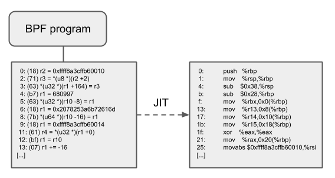

# JIT即时编译




* 64 位的 x86_64、arm64、ppc64、s390x、mips64、sparc64 和 32 位的 arm 、x86_32 架构都内置了 in-kernel eBPF JIT 编译器

打开方式：
```
$ echo 1 > /proc/sys/net/core/bpf_jit_enable
```

* 32 位的 mips、ppc 和 sparc 架构目前内置的是一个 cBPF JIT 编译器。这些只有 cBPF JIT 编译器的架构，以及那些甚至完全没有 BPF JIT 编译器的架构， 需要通过内核中的解释器（in-kernel interpreter）执行 eBPF 程序。

要判断哪些平台支持 eBPF JIT，可以在内核源文件中 grep HAVE_EBPF_JIT：

```
$ git grep HAVE_EBPF_JIT arch/
arch/arm/Kconfig:       select HAVE_EBPF_JIT   if !CPU_ENDIAN_BE32
arch/arm64/Kconfig:     select HAVE_EBPF_JIT
arch/powerpc/Kconfig:   select HAVE_EBPF_JIT   if PPC64
arch/mips/Kconfig:      select HAVE_EBPF_JIT   if (64BIT && !CPU_MICROMIPS)
arch/s390/Kconfig:      select HAVE_EBPF_JIT   if PACK_STACK && HAVE_MARCH_Z196_FEATURES
arch/sparc/Kconfig:     select HAVE_EBPF_JIT   if SPARC64
arch/x86/Kconfig:       select HAVE_EBPF_JIT   if X86_64
```

* JIT 编译器可以极大加速 BPF 程序的执行，因为与解释器相比，它们可以降低每个指令的开销（reduce the per instruction cost）。
* 通常，指令可以 1:1 映射到底层架构的原生 指令。另外，这也会减少生成的可执行镜像的大小，因此对 CPU 的指令缓存更友好。
* 对于 CISC 指令集（例如 x86），JIT 做了很多特殊优化，目的是为给定的指令产生 可能的最短操作码（emitting the shortest possible opcodes），以降低程序翻译过程所需的空间。
* JIT 在运行时会将指令编译为原生指令在本机执行
* JIT (Just-in-time) 在 2011 年引入到 cBPF


---
