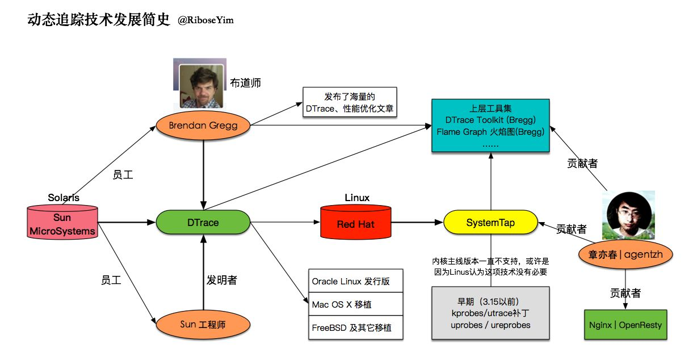

# dtrace

## 简要介绍

* DTrace（全称Dynamic Tracing)，也称为动态跟踪
* DTrace 内置在 Solaris 中，是一个全面的动态跟踪工具。
* DTrace 可以由管理员和开发者使用，并且可以在实时生产系统上安全使用。
* 使用 DTrace，可以检查用户程序的行为和操作系统的行为。
* DTrace 的用户可以通过 D 脚本语言创建定制程序。定制程序提供了动态检测系统的能力。
* 除Solaris系列以外，Dtrace已先后被移植到FreeBSD、NetBSD及Mac OS X等操作系统上。

## 图示

## 参考

* <https://zhuanlan.zhihu.com/p/24124082>
* <https://blog.openresty.com.cn/cn/dynamic-tracing/>
* <https://www.brendangregg.com/dtracetoolkit.html>
* <https://blog.openresty.com.cn/cn/dynamic-tracing/>

---
